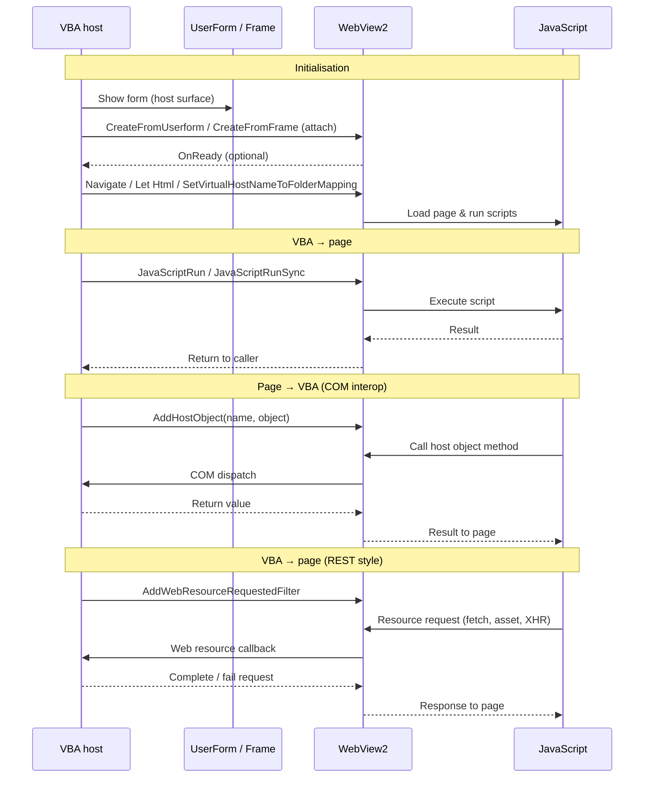

# Title (Working)

**`stdWebView`: A VBA-Native Pattern for Portable, Interactive Process Visualisation and Business Workflow Automation**

**Keywords:** VBA, WebView2, Excel automation, process engineering, business process automation, interactive visualisation

---

## Abstract

Interactive interfaces for engineering and business process analysis are often implemented as heavyweight web applications that require specialist web skills and ongoing maintenance. In many industrial environments, however, Microsoft Excel and VBA remain the most accessible integration layer for operational data, reporting, and decision support. This paper presents `stdWebView`, an open source VBA class module that embeds Microsoft Edge WebView2 in VBA UserForms, enabling rich HTML/CSS/JavaScript interfaces while retaining VBA as the orchestration layer.

We describe the architecture of `stdWebView`, practical interop patterns (host object injection, script execution, and request interception), and representative examples that demonstrate how portable, maintainable interfaces can be delivered without introducing server infrastructure. _We also outline domain case studies spanning chemical, food, infrastructure, and process management contexts, and propose a set of reusable example templates for business process and website automation._

The contribution is a pragmatic, engineering-focused methodology for teams that need modern user experience and automation capabilities inside existing Office/VBA ecosystems.

----

## Motivation

VBA has seen little substantive evolution for decades and is often labeled a legacy technology. Yet it remains one of the most widely deployed languages in financial modelling, reporting, data processing, and operational automation across finance, manufacturing, logistics, and government. Its persistence follows from its ubiquity in Microsoft Office, tight alignment with spreadsheet workflows, and the cost and risk of replacing large macro codebases. Just as importantly, VBA confers an implicit local maintenance guarantee: domain teams can own their tools and adapt them quickly, which centralised platforms often fail to provide.

This reliance creates corresponding technical debt. Many VBA applications are assembled incrementally by non-specialists, yielding fragile codebases and UserForms that struggle with contemporary interaction patterns. For numerous internal tools, a full migration to a standalone web application is disproportionate in cost and delivery complexity. The emergence of generative AI accentuates the gap, since it is generally more effective at producing web UI code than at generating robust VBA architecture or maintainable UserForm logic. Restricted IT environments also keep VBA relevant as a practical integration layer for on-premise systems, local files, and legacy data sources that newer sandboxed platforms cannot easily reach.

The central claim of this paper is that WebView2 integration is not merely a usability enhancement but an architectural requirement for many modern tools. Current workflows depend on capabilities that classic UserForms cannot efficiently deliver, including dynamic data grids, geospatial interfaces, graph and network visualisation, rich text components, and responsive layouts. Even with modern libraries such as `stdVBA`, closing this gap natively entails building and maintaining bespoke controls under a host not designed for today’s UI demands.

Embedding WebView2 within VBA provides a pragmatic third path. It preserves existing Office automation and integration while unlocking the web ecosystem of UI frameworks and components. Teams can modernise incrementally, replacing the most fragile interfaces first, reusing proven web patterns, and improving maintainability without pausing operations. In effect, this approach evolves VBA systems so they meet present-day expectations for usability, reliability, and speed of change.

### Contribution

This paper makes four major contributions. First, it presents `stdWebView`, an open source VBA class module, developed as part of the broader `stdVBA` library, that embeds Microsoft Edge WebView2 within VBA UserForms, providing a practical software artifact for modernizing Office-based applications with HTML, CSS and JavaScript. Second, it defines a practical integration architecture for VBA, that abstracts low-level COM event handling and WebView2 lifecycle management behind a high-level interface for navigation, JavaScript execution, host-object communication, HTTP request interception, and cookie management. Third, it demonstrates the applicability of this approach through case studies and examples, showing how web interfaces can be introduced into existing Excel/VBA workflows without requiring server infrastructure or full migration to a standalone web application. Finally, this approach provides a practical pathway for phased migration from legacy VBA applications towards modern web apps.

## Results

`stdWebView` exposes a small VBA API for embedding WebView2 into native UserForms and offers communication mechanisms to allow transfer of data / commands between the VBA and JavaScript runtime environments. Typical usage involves attaching the WebView to a `MSForms.Userform` or `MSForms.Frame`, navigating to sites or injecting HTML/CSS/JS, and either hijacking the webrequest system to serve pages and data requests like a regular HTTP server or injecting a host COM object which javascript can automate directly. Consult the sequence diagram below for an overview of the functionality.

## Case studies

### Geospatial map

Geospatial UI is one of the most complicated user interfaces to build from scratch and there are no existing geospatial map libraries for VBA, which don't also require installation from administrators. Reimplementing projections, tiling, layers, editing tools etc. is a lot of work and even if you managed to reimplement all of these tools, without folders to organise code in the VBA IDE any project you use this library in will quickly become a jumbled mess of classes for the GIS UI element and classes for the actual app/business logic, making implementation in pure VBA unfeasible.

Web technologies, however, already have established packages for geospatial tools and UI elements e.g. Leaflet, Proj4, TurfJS, EsriJS...  Our first case study shows how a simple geospatial map element can be implemented within 200 lines of VBA using `stdWebView`. This demonstration shows how html can be injected into a webview, and adding a host object can be used to automated VBA from inside the web application.

While `stdWebView` doesn't fix VBA project ergonomics, it moves the UI code which is hard in VBA, to HTML/JS providing significantly greater flexibility, and the ability to use custom libraries written by other developers. The VBA side ultimately becomes a bridge of bindings to the data model, rather than operating the whole vision.

### List object viewer

One of the main reasons people build UserForms in VBA is to display and edit structured data. A common pattern is fill a textbox from a template, and some handlebar syntax to quickly display data. You can build dynamic UIs in VBA, but hooking up events for controls you create at runtime is awkward, so most forms end up as a fixed set of labels and boxes laid out by hand. That takes a lot of time, and it gets painful when the data isn't fl1at. For instance, one employee with a list of next steps sitting underneath. In HTML/CSS/JS, layouts that change with the data are the normal way of working, not a special case.

Our list object viewer case study is a simple example of that: open a UserForm, step through rows in an Excel table, and a `stdWebView` panel shows that row's employee details plus the next steps linked to them. The same screen in pure VBA would be tedious to build, a headache to maintain and provide a poorer user experience.

### Customising existing organisation webapps

Over the last couple of decades most large organisations have moved toward cloud-hosted, browser-based tools, accelerated by remote working during COVID-19. The platforms IT rolls out are usually deliberately generic. Applications tend to be useful to lots of teams, but rarely shaped around one team's exact workflow.

SharePoint is a typical example of this, with lists, files, and permissions that work well for everyone, but not necessarily your team's specific business process. Custom scripting inside SharePoint can often be turned on in admin settings, yet in practice it is frequently disabled for security reasons. That leaves domain teams stuck between "use the standard app as-is" and "wait for a bespoke IT project."

A `stdWebView` UserForm can sit in the gap. The user signs in to the real web app inside the control; you reuse that session (for example via cookies) to call the same APIs and pages the browser would, on their behalf. Or you skip deep integration and simply host a small HTML UI that wraps a narrow task with extra buttons, validation, or a wizard. These controls can be integrated into the host application, retaining the feeling like they're part of the tool they already use.

### Data flows driven by node editors

When it comes to rendering VBA tends to offer strict controls that always draw the same kind of UI, and rarely do they allow truly custom looking UI to be created. Although it is possible to use [GDI32 or GDI+](...alesandro...) libraries targetting a hwnd to draw custom UI on top of a VBA userform, this tends to be convoluted and requires deep knowledge of the stacks in question. Additionally, if what you are rendering requires shaders, both GDI and GDI+ are a no-go, and the only viable alternative for anything close to GPU processing is OpenCL, yet another convoluted library to understand and execute under.

In this case study we demonstrate a webview's usage to provide users with a low-code option for building data pipelines.

* Demonstrator applications
    * ListObject viewer dashboard
    * wuiUI
    * SharePoint updater
    * STC24 data entry cards

* Observed benefits and trade-offs

## Technical Design of `stdWebView`

3.1 - Architecture and lifecycle
    - COM interop and callback adaptation
    - Event dispatch and host integration
3.2 Interaction model
3.3 Deployment and security considerations
3.4 Evaluation approach

This is where you explain:

initialization
readiness callbacks
cleanup
data flow
use of stdICallable
runtime dependency on WebView2
any reproducibility or comparison notes

## Discussion

If the journal tolerates a Discussion section, use it. If not, you can merge this into Results or Conclusion.

This section can cover:

where the approach works well
when it is preferable to native forms
when a full web app is still better
maintainability implications
the LLM point, if you want it somewhere explicit

## 5. Conclusion
Summarize:

stdWebView as a bridge between VBA and web UI
practical value in Office-centric environments
future work: broader examples, empirical validation, more sector-specific case studies

----

## Dev Remarks:

inlude it if it answers one of these:

* Why was this hard in VBA?
* What architectural pattern made it possible?
* What part of the implementation would another advanced VBA developer need to understand to reproduce or extend the approach?
* What demonstrates that this is more than just "host a browser control"?

Do not include it if it is mainly:

* every low-level trick you used,
* class-internals interesting only to VBA systems hackers,
* undocumented mechanics that are not central to the paper's contribution.
* Your thunk/vtable example

What you described is absolutely interesting, because it gets at the real engineering challenge:

* WebView2 expects callback interop at a lower level than idiomatic VBA normally exposes.
* Therefore the class needs an interop layer that adapts pointer-based callbacks into object-oriented VBA methods.
* That is likely part of the paper's genuine technical contribution.

Include in Methods.

