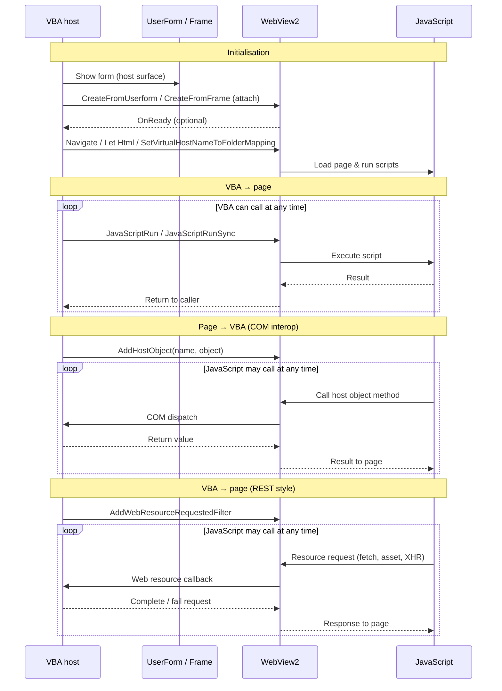
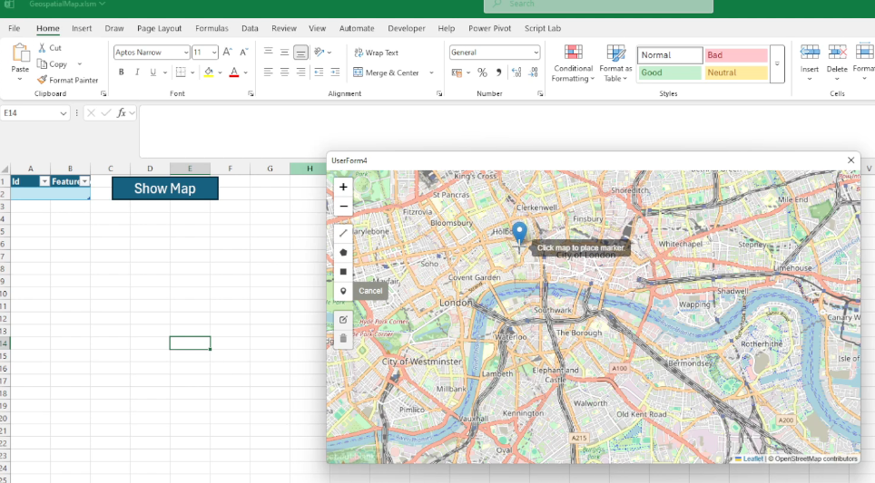
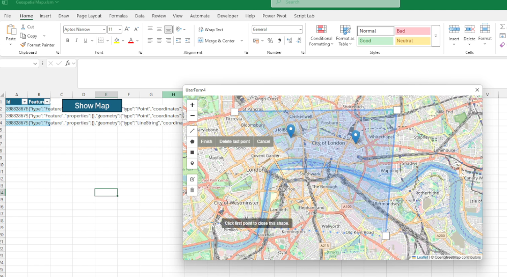
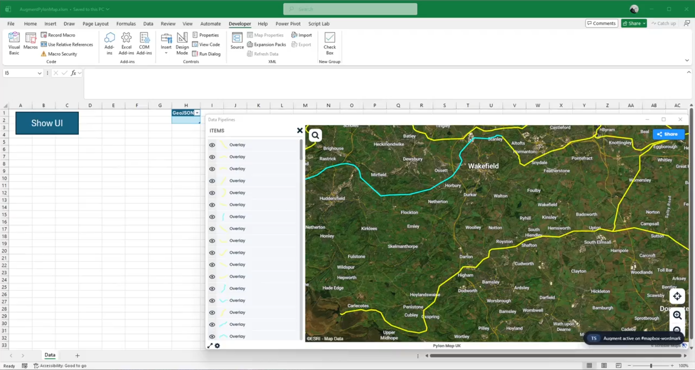
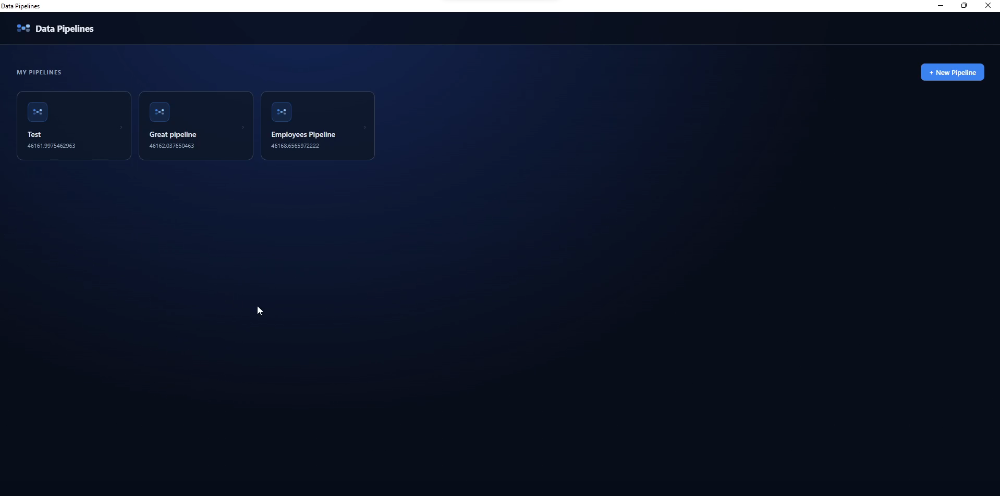
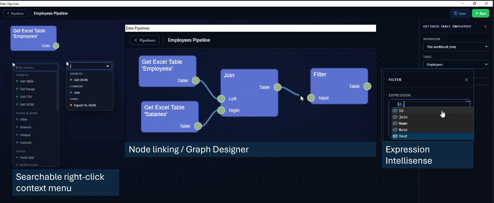

**Keywords:** VBA, WebView2, Excel automation, process engineering, business process automation, interactive visualisation, COM interop, low-code development, legacy system modernisation

---

# `stdWebView`: Embedding Modern Web Interfaces in Legacy VBA Systems with WebView2

## Abstract

Interactive interfaces for engineering and business process analysis are often implemented as heavyweight web applications that require specialist web skills and ongoing maintenance. In many industrial environments, however, Microsoft Excel and Visual Basic for Applications (VBA) remain the most accessible integration layer for operational data, reporting, and decision support. This paper presents `stdWebView`, an open source VBA class module that embeds Microsoft Edge WebView2 in VBA UserForms, enabling rich HTML/CSS/JavaScript interfaces while retaining VBA as the orchestration layer.

We describe the architecture of `stdWebView`, practical interop patterns (host object injection, script execution, and request interception), and representative examples that demonstrate how portable, maintainable interfaces can be delivered without introducing server infrastructure. *We also outline domain case studies spanning chemical, food, infrastructure, and process management contexts, and propose a set of reusable example templates for business process and website automation.*

The contribution is a pragmatic, engineering-focused methodology for teams that need modern user experience and automation capabilities inside existing Office/VBA ecosystems.

---

## 1. Introduction

VBA has seen little substantive evolution for decades[<sup>[9]</sup>](#ref-9 "Wikipedia: VBA version history")<sup>,</sup>[<sup>[10]</sup>](#ref-10 "Microsoft: Last major VBA update") and is often labeled a legacy technology. Yet it remains one of the most widely deployed languages in financial modelling, reporting, data processing, and operational automation across finance, manufacturing, logistics, and government[<sup>[1]</sup>](#ref-1 "Berger 2025")<sup>,</sup>[<sup>[2]</sup>](#ref-2 "Abisoye and Akerele 2021")<sup>,</sup>[<sup>[3]</sup>](#ref-3 "Agrrawal 2009")<sup>,</sup>[<sup>[4]</sup>](#ref-4 "Barbieri et al. 2024")<sup>,</sup>[<sup>[5]</sup>](#ref-5 "Feiman 2011")<sup>,</sup>[<sup>[6]</sup>](#ref-6 "Khan et al. 2021"). Its persistence follows from its ubiquity in Microsoft Office, tight alignment with spreadsheet workflows, and the cost and risk of replacing large macro codebases. Just as importantly, VBA confers an implicit local maintenance guarantee: domain teams can own their tools and adapt them quickly, which centralised platforms often fail to provide.

In chemical process engineering, VBA is embedded in standard practice as an automation and orchestration layer for commercial process simulators such as Aspen HYSYS and Aspen Plus, where it is used to drive parameter sweeps, link simulation outputs to custom reporting templates, and interface with optimisation tools[<sup>[23]</sup>](#ref-23 "Valverde 2022")<sup>,</sup>[<sup>[24]</sup>](#ref-24 "Bartolomé 2022"). Similarly, food manufacturing, environmental sampling, and laboratory operations routinely rely on Excel-VBA for LIMS-adjacent data workflows that do not justify the cost of dedicated software licences[<sup>[36]</sup>](#ref-36 "Çağındı 2004")<sup>,</sup>[<sup>[37]</sup>](#ref-37 "Thurow 2004").

This reliance creates corresponding technical debt. Many VBA applications are assembled incrementally by non-specialists, yielding fragile codebases and UserForms that struggle with contemporary interaction patterns. For numerous internal tools, a full migration to a standalone web application is disproportionate in cost and delivery complexity. The emergence of generative AI accentuates the gap, since it is generally more effective at producing web UI code than at generating robust VBA architecture or maintainable UserForm logic[<sup>[11]</sup>](#ref-11 "Survey: Code LLMs for low-resource DSLs"). Restricted IT environments also keep VBA relevant as a practical integration layer for on-premise systems, local files, and legacy data sources that newer sandboxed platforms cannot easily reach.

The central claim of this paper is that WebView2 integration is not merely a usability enhancement but an architectural requirement for many modern tools. Current workflows depend on capabilities that classic UserForms cannot efficiently deliver, including dynamic data grids, geospatial interfaces, graph and network visualisation, rich text components, and responsive layouts. Even with modern libraries such as `stdVBA`, closing this gap natively entails building and maintaining bespoke controls under a host not designed for today's UI demands.

Embedding WebView2 within VBA provides a pragmatic third path. It preserves existing Office automation and integration while unlocking the web ecosystem of UI frameworks and components. Teams can modernise incrementally, replacing the most fragile interfaces first, reusing proven web patterns, and improving maintainability without pausing operations.

This paper makes four major contributions. First, it presents `stdWebView`, an open source VBA class module, developed as part of the broader `stdVBA` library, that embeds Microsoft Edge WebView2 within VBA UserForms, providing a practical software artifact for modernizing Office-based applications with HTML, CSS and JavaScript[<sup>[19]</sup>](#ref-19 "Microsoft: WebView2 NuGet package"). Second, it defines a practical integration architecture for VBA, that abstracts low-level COM event handling and WebView2 lifecycle management behind a high-level interface for navigation, JavaScript execution, host-object communication, HTTP request interception, and cookie management. Third, it demonstrates the applicability of this approach through case studies and examples, showing how web interfaces can be introduced into existing Excel/VBA workflows without requiring server infrastructure or full migration to a standalone web application. Finally, it discusses considerations for teams assessing a phased migration from legacy VBA applications towards modern web-based tools, including dependency management, security, and deployment scope.

---

## 2. Related Work

The work presented in this paper sits at the intersection of four established research threads: the use of Excel and VBA as automation layers in engineering and process industries, the persistence of legacy tooling in the face of digital transformation, the emergence of low-code development as a formal paradigm, and the deployment of web-based interactive interfaces for engineering data tasks.

### 2.1 VBA and Excel as Automation Layers in Chemical and Food Process Engineering

Despite its age, VBA remains the dominant scripting language for orchestrating process simulation software in chemical engineering practice. Valverde et al.[<sup>[23]</sup>](#ref-23 "Valverde 2022") document the use of Excel-VBA as the primary interface for Aspen HYSYS automation in a university master's programme, demonstrating that parameter sweeps, case studies, and custom outputs can be driven entirely through VBA macros without modification of the simulator itself. Bartolomé and Van Gerven[<sup>[24]</sup>](#ref-24 "Bartolomé 2022") performed a systematic comparison of available Aspen HYSYS interconnection methodologies and established Excel-VBA as the reference integration pattern endorsed in the official Aspen HYSYS automation manual; their benchmark covers steady-state and dynamic scenarios and includes a direct MATLAB comparison. Csendes et al.[<sup>[25]</sup>](#ref-25 "Csendes 2023") in their survey on multi-software engineering patterns across the broader chemical simulation landscape, confirming that MS Excel-VBA frequently serves as the mediator layer between process simulators and external optimisation tools such as MATLAB, GAMS, and Python.

These patterns extend into food process engineering specifically. Golman and Yermukhambetova[<sup>[27]</sup>](#ref-27 "Golman 2019") developed an Excel-VBA educational module for spray drying simulation — a unit operation central to the food, pharmaceutical, and ceramic industries — demonstrating that mass and energy balance calculations, process optimisation, and energy recovery analysis can be delivered through VBA macros with no additional software dependencies. Norton and Tiwari[<sup>[28]</sup>](#ref-28 "Norton 2010") applied VBA to model high-pressure freezing, a novel food preservation process, using an explicit finite-difference heat-transfer formulation, establishing VBA as a viable platform for process simulation in undergraduate food engineering curricula. Across these applications, a recurring constraint is apparent: VBA provides the orchestration and reporting layer that connects commercial simulators to the analyst's workflow, but it offers no modern UI mechanism for the dashboards, configuration panels, and interactive result views that such workflows increasingly require. `stdWebView` directly addresses this gap.

### 2.2 Digital Transformation and the Persistence of Legacy Tooling in Process Industries

The argument for `stdWebView` rests in part on the documented persistence of spreadsheet-based workflows even in organisations undergoing active digital transformation. Chatterjee et al.[<sup>[29]</sup>](#ref-29 "Chatterjee 2022") surveyed food and beverage companies and found substantial adoption of Industry 4.0 technologies alongside continued reliance on existing operational workflows; they frame this as a coexistence challenge rather than a replacement, and argue that change management and workforce readiness constrain how rapidly spreadsheet-centric processes can be supplanted. Konur et al.[<sup>[30]</sup>](#ref-30 "Konur 2021") present a case study of a food manufacturer modernising a production system over a century old, noting that the absence of existing digital infrastructure is the most significant practical barrier to Industry 4.0 adoption, and proposing an incremental strategy that layers IoT and analytics capability onto legacy machinery without full replacement. Tran et al.[<sup>[31]</sup>](#ref-31 "Tran 2022") provide a systematic overview of brownfield retrofitting approaches across manufacturing, documenting that legacy system constraints, rather than lack of technology awareness, are the primary reason organisations retain existing tooling during industrial digitisation programmes. Together, these studies frame the engineering-software problem that `stdWebView` addresses: legacy Excel-VBA tooling persists not through inertia alone but because its replacement cost and operational risk are high. Incremental augmentation — the approach `stdWebView` enables — is the strategy most commonly recommended in this literature.

### 2.3 Low-Code Development Platforms

The term *low-code* was formalised by Forrester Research in 2014 and refers to software development approaches that reduce or eliminate traditional hand-coding through visual programming environments, prebuilt components, and abstracted deployment pipelines. Da Cruz et al.[<sup>[32]</sup>](#ref-32 "da Cruz 2021") define the functional and non-functional requirements of a low-code platform and present an open-source reference implementation, establishing that "low-code and no-code platforms rely on visual application development without the complexity associated with traditional software development." Rokis and Kirikova[<sup>[33]</sup>](#ref-33 "Rokis 2023") provide the most comprehensive systematic literature review of low-code development to date, synthesising definitions, platform feature taxonomies, and governance challenges across 46 primary studies; notably, manufacturing and industrial applications appear in their domain taxonomy. Di Ruscio et al.[<sup>[34]</sup>](#ref-34 "Di Ruscio 2022") situate low-code platforms within the longer history of abstraction-raising development approaches — 4GLs, RAD, model-driven engineering — and argue that the practical distinction of contemporary low-code platforms is their citizen-developer targeting and integrated lifecycle tooling.

`stdWebView` does not claim to be a low-code platform in the cloud-platform sense, but it occupies the same design space: it allows VBA developers — often domain experts rather than professional programmers — to assemble rich interfaces by composing HTML/JS components rather than writing native control code, without introducing server infrastructure or deployment pipelines. In Rokis and Kirikova's taxonomy, this positions `stdWebView` as a *domain-specific low-code companion* to VBA, analogous to node-based tools such as Node-RED in the IoT domain.

### 2.4 Web-Based GIS and Interactive Interfaces for Environmental and Process Data

Gong et al.[<sup>[26]</sup>](#ref-26 "Gong 2015") proposed a real-time GIS data model and Sensor Web service platform for environmental data management, demonstrating real-time retrieval and visualisation of air quality, soil moisture, and meteorological data through web interfaces; their architecture shows that web-based map rendering is now the standard output layer for sensor-dense environmental monitoring workflows. Voutos et al.[<sup>[35]</sup>](#ref-35 "Voutos 2017") extended this approach to Arduino-based citizen sensing, integrating IoT pollution sensors with a web GIS portal for spatial overlay of measurements alongside temporal queries. The geospatial case study in Section 4.1, built on Leaflet.js via `stdWebView`, draws on the same design principles as these server-hosted platforms — but delivers them inside an Excel workbook without requiring browser access, a web server, or IT-managed infrastructure.

### 2.5 LIMS and Laboratory Data Management in Food and Chemical Engineering

Laboratory Information Management Systems (LIMS) represent the formal software tier for analytical data management in food manufacturing and testing laboratories. Çağındı and Ötleş[<sup>[36]</sup>](#ref-36 "Çağındı 2004") documented the role of LIMS specifically in food processing factories, establishing that LIMS are essential for sample tracking, result archiving, regulatory reporting, and quality assurance; their analysis highlights that laboratories without dedicated LIMS typically rely on paper records or spreadsheet-based workarounds that lack audit-trail integrity. For the chemical processing sector, Thurow et al.[<sup>[37]</sup>](#ref-37 "Thurow 2004") evaluated state-of-the-art LIMS for chemical and life science process applications, identifying that existing systems lacked the flexibility and process connectivity needed for on-line process adaptation, and proposed a fully web-oriented LIMS architecture to address these gaps. Heinen et al.[<sup>[38]</sup>](#ref-38 "Heinen 2020") note that individually managed spreadsheets are the baseline condition that LIMS projects are designed to improve upon, and confirm that high initial cost prevents most small analytical units from acquiring commercial systems. The accreditation dimension adds a further constraint: Martínez-Perales and Ortiz-Marcos[<sup>[39]</sup>](#ref-39 "Martínez-Perales 2021") analysed the challenges faced by ISO/IEC 17025 laboratories and found that documentation and record control are the most difficult requirements to fulfil, proposing agile implementation approaches for laboratories with limited resources.

The combined picture is consistent: food and analytical laboratories at all scales rely on Excel-based workflows that sit at the LIMS boundary — structured enough to generate compliant records, but not equipped with the workflow review interfaces, batch-record navigation, or linked non-conformance views that modern quality management demands. The list object viewer case study in Section 4.2 directly addresses this gap without requiring a LIMS licence, a web server, or replacement of the existing Excel data model.

---

## 3. Architecture and API Design of `stdWebView`

`stdWebView` exposes a small VBA API for embedding WebView2 into native UserForms and offers communication mechanisms to allow transfer of data and commands between the VBA and JavaScript runtime environments[<sup>[19]</sup>](#ref-19 "Microsoft: WebView2 NuGet package"). Typical usage involves attaching the WebView to a `MSForms.UserForm` or `MSForms.Frame`, navigating to sites or injecting HTML/CSS/JS, and either hijacking the web-request system to serve pages and data requests like a regular HTTP server or injecting a host COM object which JavaScript can automate directly. Figure 1 below shows an overview of the initialisation sequence and the three communication modes.



**Figure 1:** Sequence diagram of `stdWebView` initialisation and VBA–JavaScript communication modes.
---

## 4. Case Studies

### 4.1 Geospatial Map

Geospatial UI is one of the most complicated user interfaces to build from scratch and there are no existing geospatial map libraries for VBA that do not also require installation from administrators. Reimplementing projections, tiling, layers, and editing tools is prohibitively complex in pure VBA, and without folders to organise code in the VBA IDE any project using such a library quickly becomes a jumbled mess of classes for the GIS UI element and classes for the actual business logic.

Web technologies already have established packages for geospatial tools and UI elements, e.g. Leaflet, Proj4, TurfJS, EsriJS. This case study shows how a simple geospatial map element can be implemented within 200 lines of VBA using `stdWebView`, demonstrating how HTML can be injected into a WebView and how a host object can be used to automate VBA from inside the web application.

[](case-studies/01-geospatial-map/still-1.png)

[](case-studies/01-geospatial-map/still-2.png)

[[GitHub] Geospatial map](https://github.com/sancarn/stdVBA-examples/tree/main/Examples/WebView/2.%20Geospatial%20Map) · [[Video] Watch geospatial demo](https://sancarn.github.io/vba-webviews-paper/case-studies/01-geospatial-map/geospatial-demo.mp4)

In environmental engineering, this pattern directly supports field sampling-site management, pollution-source mapping, pipeline inspection dashboards, and real-time sensor overlay on web GIS layers — workflows documented in web-based environmental monitoring platforms[<sup>[26]</sup>](#ref-26 "Gong 2015"). In infrastructure operations, the pylon-map augmentation variant (Case Study 4.3) demonstrates the same capability for asset-condition recording by field teams operating under regulatory inspection schedules.

---

### 4.2 List Object Viewer

One of the main reasons people build UserForms in VBA is to display and edit structured data. Building dynamic UIs in VBA is awkward because hooking up events for controls created at runtime is cumbersome, so most forms end up as a fixed set of labels and boxes laid out by hand. That takes a lot of time, and it gets painful when the data is not flat — for instance, one employee with a list of next steps beneath. In HTML/CSS/JS, layouts that change with the data are the normal way of working, not a special case.

This case study is a simple example: open a UserForm, step through rows in an Excel table, and a `stdWebView` panel shows that row's employee details plus the next steps linked to them. The same screen in pure VBA would be tedious to build, a headache to maintain, and provide a poorer user experience.

[](case-studies/02-list-object-viewer/loviewer-demo.gif)

[[GitHub] List object viewer](https://github.com/sancarn/stdVBA-examples/tree/main/Examples/WebView/1.%20ListObjectViewer)

In food quality control and analytical laboratories, this pattern maps directly to LIMS record-review interfaces, where a technician steps through sample rows and views linked test results, batch metadata, and non-conformance notes in a dynamically rendered panel. The same approach applies to ingredient traceability workflows in HACCP-governed processes, where a batch record links to multiple supplier certificates, audit logs, and corrective action records — a layout trivial in HTML/CSS but laborious to build and maintain in native VBA controls.

---

### 4.3 Customising Existing Organisation Web Apps

Over the last couple of decades most large organisations have moved toward cloud-hosted, browser-based tools, accelerated by remote working during COVID-19. The platforms IT rolls out are usually deliberately generic — useful to many teams but rarely shaped around one team's exact workflow.

SharePoint is a typical example: lists, files, and permissions that work well for everyone in general, but not necessarily for your team's specific business process. Custom scripting inside SharePoint can often be turned on in admin settings, yet in practice it is frequently disabled for security reasons, leaving domain teams stuck between "use the standard app as-is" and "wait for a bespoke IT project."

A `stdWebView` UserForm can sit in the gap. The user signs in to the real web app inside the control; the session (e.g. cookies) is reused to call the same APIs and pages the browser would on their behalf. Alternatively, a small HTML UI wraps a narrow task with extra buttons, validation, or a wizard — controls that can be integrated into the host application, retaining the feeling that they are part of the tool the user already uses.

[](case-studies/03-existing-webapps/sharepoint-auth-window.png)

[](case-studies/03-existing-webapps/still-1.png)

[](case-studies/03-existing-webapps/still-2%20--%20custom%20context%20menu.png)

[[GitHub] SharePoint updater](https://github.com/sancarn/stdVBA-examples/tree/main/Examples/WebView/4.%20Sharepoint%20Updator) · [[GitHub] Pylon augmentation](https://github.com/sancarn/stdVBA-examples/tree/main/Examples/WebView/6.%20Augment%20pylon%20map) · [[Video] Watch pylon demo](https://sancarn.github.io/vba-webviews-paper/case-studies/03-existing-webapps/pylon-mapper.mp4)

For food manufacturers and chemical plants operating under ISO 22000 or ISO/IEC 17025, SharePoint is a common document-control backbone. This pattern enables domain teams to build wizard-style non-conformance reporting or deviation-approval workflows on top of SharePoint without requiring IT intervention or modification of the base platform. The same approach applies to procurement and supplier qualification workflows in regulated manufacturing, where forms must enforce structured data entry but the underlying platform cannot be customised by the domain team.

---

### 4.4 Data Flows Driven by Node Editors

VBA's rendering capabilities are strictly limited by its controls, which always draw the same kind of UI. Although it is possible to use GDI32[<sup>[12]</sup>](#ref-12 "GDI32 reference") or GDI+[<sup>[13]</sup>](#ref-13 "GDI+ reference") libraries targeting an HWND to draw custom UI on top of a VBA UserForm, this is convoluted and requires deep knowledge of the stack in question. For anything requiring shaders, both GDI and GDI+ are not viable options.

This case study shows how a WebView can give users a low-code way to build data pipelines. Instead of recreating a complex visual editor in native VBA controls, the interface can offer polished interactions — context-aware actions, searchable node insertion, and expression intellisense from table or file metadata — using HTML5, CSS, and JavaScript libraries for the frontend, while data persistence, business logic, and side-effects remain in VBA via `stdWebView`'s interoperability layer.

[](case-studies/04-data-pipelines/still-0.png)

[](case-studies/04-data-pipelines/still-comb-1.png)

[[GitHub] Pipeline editor](https://github.com/sancarn/stdVBA-examples/tree/main/Examples/WebView/5.%20Data%20Pipelines) · [[Video] Watch pipeline demo](https://sancarn.github.io/vba-webviews-paper/case-studies/04-data-pipelines/pipeline-demo.mp4)

In chemical process engineering, this node-editor pattern directly supports visual process-flow diagram construction and the representation of mass-balance models. An engineer can sketch a unit-operation network visually, with connections persisted to Excel ranges that feed into an Aspen HYSYS or Aspen Plus automation script via the standard Excel-VBA COM interop bridge[<sup>[24]</sup>](#ref-24 "Bartolomé 2022"). In food manufacturing, the same pattern enables low-code ETL pipeline authoring for production data feeds from line sensors to reporting templates, without requiring Python or database skills from the process engineer.

---

## 5. Discussion

### 5.1 Benefits and Trade-offs

Using WebView UserForms opens up a world of sophisticated UI features and access to the powerful ecosystem of modern JavaScript libraries, but this flexibility comes with a new set of complexities. Instead of spending most of your time on laborious VBA UserForm layouts, you are now navigating asynchronous JavaScript, cross-language communication, and the quirks of both JS/HTML/CSS and native VBA code. Debugging can become more involved and there are new deployment considerations, from ensuring that WebView2 is present to managing security boundaries in mixed web/native applications.

Additionally, many JavaScript ecosystem tools rely on build pipelines and frameworks (Webpack, Vite, React, etc.), introducing more options, abstractions, and dependencies into the development process. For some VBA developers, the simplicity and constraints of native VBA components might be preferable.

---

### 5.2 Dependency-Free Design

`stdWebView` creates an instance of WebView2 using a pre-installed `WebView2Loader.dll`, found in `C:\Program Files\Microsoft Office\root\Office16\ADDINS\Microsoft Power Query for Excel Integrated\bin`, which is included with Microsoft Excel as part of its PowerQuery integration. This approach, originally discovered by VBA developer tarboh[<sup>[14]</sup>](#ref-14 "tarboh: WebView2 For Excel VBA"), enables the creation of a WebView2 instance without needing to install additional type libraries or binaries — an action that would typically require administrator rights.

To bypass the requirement for a registered type library, tarboh uses `DispCallFunc` from `OleAut32.dll`[<sup>[15]</sup>](#ref-15 "sancarn: stdCOM.cls")<sup>,</sup>[<sup>[16]</sup>](#ref-16 "vbForums: VB6 Call Functions By Pointer") to invoke methods directly via their vtable pointers and function offsets, effectively emulating the way C code calls COM object members. This provides late-bound, vtable-driven COM interop from VBA with no external dependencies beyond those already shipped with Office.

Where `stdWebView` diverts from Tarboh's approach is by introducing a Win64 port of an x86 thunk, used to create pointers to class public instance methods. This makes the vision of a dependency-free, self-contained `stdWebView` a reality — the entire module can be dropped into any project without extra setup.

### 5.3 Late-Bound COM Interop

WebView2 exposes its native API through COM interfaces and asynchronous callbacks. VBA does not provide a convenient way to implement arbitrary WebView2 callback interfaces or expose raw function pointers for instance methods. `stdWebView` therefore needs an interop layer that can both call WebView2 methods and present VBA methods as callback targets.

As documented in API Callbacks Using an Object's Procedure[<sup>[17]</sup>](#ref-17 "vbForums: API CallBacks Using an Object's Procedure"), VBA objects are COM objects, with the following VTable layout. Each instance stores a pointer to its public vtable:

```
ObjPtr(o) --> [IUnknown::QueryInterface]
              [IUnknown::AddRef]
              [IUnknown::Release]
              [IDispatch::GetTypeInfoCount]
              [IDispatch::GetTypeInfo]
              [IDispatch::GetIDsOfNames]
              [IDispatch::Invoke]
              [Public method 1]
              [Public method 2]
              ...
              [Public method n]
              [Private/Friend methods (arbitrary order)]
```

> Internally, the VB runtime maintains additional metadata immediately adjacent to the vtable (used for private members and other bookkeeping), but that is unrelated to this mechanism and not used here.

### 5.4 Adapting VBA Methods into Native Callbacks

With a known pointer size, we can compute the address of the N-th public method directly. However, object methods expect a `this` pointer, while a typical C callback jumps directly to a bare function address.

To reconcile the two calling conventions, a small thunk is generated — a short block of executable code that prepends the object instance pointer each time the function is called. The thunk address can then be used as a conventional callback function pointer in APIs that expect one.

The implementation also introduces EBMode protection, inspired by the work of TheTrick[<sup>[18]</sup>](#ref-18 "TheTrick: VbTrickTimer"), which extends Elroy's original thunk by detecting when the VBA IDE is in break mode and suppresses callback execution to avoid Office application crashes.

### 5.5 Invoking VBA from JavaScript

Direct calls from JavaScript to VBA are achieved by utilising the standard WebView2 API's host-object functionality. Any object that implements `IDispatch` — including all VBA objects — can serve as a host object. This allows you to expose any VBA class or object to JavaScript by registering it, enabling JavaScript code to call into VBA through that object.

`stdWebView` has one minor dependency on `stdICallable`. While any dependency is not ideal, `stdICallable` is the key component enabling integration with the broader `stdVBA` ecosystem. Callback support in `stdWebView` is optional but, when needed, works seamlessly with standard `stdLambda` or `stdCallback` objects.

### 5.6 Considerations

`stdWebView` is only compatible with Windows OS. In principle, a similar class could be designed for macOS with SafariView or WKWebView, but such an implementation would need a different architecture, as macOS lacks the COM infrastructure and executable memory model that `stdWebView` relies on.

A key implementation detail is that `stdWebView` bootstraps WebView2 using the `WebView2Loader.dll` shipped with Excel. Although this enables dependency-free deployment in many managed environments, this is not a documented or guaranteed public contract for Office. Future Office updates or enterprise hardening policies may alter or remove this availability. The approach should be treated as opportunistic rather than guaranteed, and production deployments should include a fallback strategy. A copy of `WebView2Loader.dll` can be downloaded from the official WebView2 NuGet package[<sup>[19]</sup>](#ref-19 "Microsoft: WebView2 NuGet package").

Unless the HTML application is stored in a centralised remote drive accessible to all users, extremely large JavaScript applications may be infeasible to distribute or maintain. Large codebases would have to be written as minified JavaScript strings in the VBE, or extracted from Excel shapes — a mechanism not designed for large volumes of text.

An alternative approach is to store the entire HTML application in the zipped `xlsm` binary, unzipping it to a temporary directory at runtime and configuring a hostname-to-folder mapping at initialisation. Care must be taken to update `[Content_Types].xml` with all extensions used in the application payload to avoid Excel corruption errors[<sup>[20]</sup>](#ref-20 "Leandro Ascierto: VBA resource file editor").

### 5.7 Security Considerations

The **utmost** care should be taken when navigating WebView2 to untrusted locations while also exposing VBA/COM host objects. In principle, any host object could be exploited by a third-party attacker to extract data from an organisation. Extra care must be taken in defining the object models to which untrusted websites are given access.

For example, when implementing a feature where hyperlinks are launched by clicking a button in the WebView, do not use the Shell function or `FollowHyperlink` directly[<sup>[21]</sup>](#ref-21 "BleepingComputer: Windows 11 Notepad markdown links issue") without link sanitisation:

**Listing 1: Insecure host object — AVOID**
```vba
Public Sub OpenLink(ByVal link As String)
  Call ThisWorkbook.FollowHyperlink(link)
End Sub
```

**Listing 2: Validated host object — ACCEPTABLE**
```vba
Public Sub OpenLink(ByVal link As String)
  link = LCase(Trim(link))
  If Not InStr(1, link, "https://my/site") = 1 Then
    Err.Raise vbObjectError + 513, "OpenLink", "URL Blocked"
  End If
  Call ThisWorkbook.FollowHyperlink(link)
End Sub
```

**Listing 3: Parameterised host object — PREFERRED**
```vba
Public Sub OpenGoogleMaps(ByVal lat As Double, ByVal lng As Double)
  Const url_template As String = "https://maps.google.com?q={lat},{long}"
  Dim url As String: url = url_template
  url = Replace(url, "{lat}", lat)
  url = Replace(url, "{long}", lng)
  Call ThisWorkbook.FollowHyperlink(url)
End Sub
```

An additional risk is that of supply chain attacks, where a third-party JavaScript library is compromised and used to deliver malicious code. Mitigations include: bundling required libraries locally and reviewing their contents before deployment; pinning dependencies to known, vetted versions; regularly auditing packages; and never passing host objects to libraries without constraints.

It is also important to limit VirtualHost-to-folder mappings. A folder mapping exposes not only that folder but all descendants to the WebView. Combined with supply chain risks, this could lead to serious data leaks without developer prudence.

**Note for process and operational technology (OT) environments.** In regulated or process-critical deployments — food production sites, chemical plants, water utilities — an `stdWebView`-enabled Excel workbook may sit on the same network as SCADA HMIs, DCS historian exports, or other operational technology systems. In such cases, the workbook should be treated as an IT/OT boundary artefact and access control policies should follow ICS security guidance (e.g. NIST SP 800-82 or IEC 62443). Host objects exposed to web content must be scoped to the minimum required API surface, and VirtualHost-to-folder mappings must be restricted to prevent unintended exposure of OT-adjacent file paths.

Key security principles:

- Treat all web content as insecure
- Avoid generic proxies
- Validate all message payloads and host object parameters
- Restrict WebView features that are not required

For additional guidance, consult the Microsoft WebView2 security documentation[<sup>[22]</sup>](#ref-22 "Microsoft Learn: WebView2 security guidance").

---

## 6. Conclusion

This paper has argued that embedding WebView2 in VBA is not simply a cosmetic upgrade to UserForms but a practical architectural pattern for extending the lifespan and capability of systems built in Microsoft Office and that this argument is particularly compelling in chemical process engineering, food manufacturing, and environmental monitoring, where Excel-VBA has become structurally embedded in operational practice in ways that make full platform replacement both costly and operationally risky.

In chemical process engineering, VBA persists as the canonical orchestration layer between process simulators such as Aspen HYSYS and Aspen Plus and the analyst's reporting, optimisation, and decision-support workflows. In food manufacturing, it underpins LIMS-adjacent quality control pipelines, batch traceability records, and ISO 22000 and ISO/IEC 17025 compliance workflows that domain teams own and maintain directly without dependence on centralised IT. In environmental monitoring, it anchors the spreadsheet-based data collection and spatial reporting workflows through which field teams record sampling events, track regulatory compliance, and manage asset inspections. In all three domains, the common constraint is identical: the data already lives in Excel, the business logic already lives in VBA, and the cost and disruption of full migration to a standalone web application cannot be justified against the scale of the individual tool.

`stdWebView` addresses this constraint directly. The case studies presented in this paper — a geospatial sampling-site map built in 200 lines of VBA, a LIMS-style record-review panel for QC batch data, a SharePoint workflow extension for document-controlled environments, and a visual process-flow node editor that can drive Aspen HYSYS automation — are not demonstrations of novelty for its own sake. They are demonstrations that the interaction patterns chemical, food, and environmental engineers actually need, and cannot efficiently build with native VBA controls, are achievable inside Excel without server infrastructure and without replacing the existing data model.

The technical architecture that makes this possible — vtable-driven COM interop, EBMode-protected thunks, host object injection, and request interception — is non-trivial, but `stdWebView` encapsulates it fully. The integration points it exposes are deliberately narrow: VBA calls JavaScript, JavaScript calls back into controlled host objects, and request interception serves resources and data without exposing arbitrary file system access. This narrowness is a security property as much as a design choice, and it is particularly important in process-critical or food-safety-regulated environments where the Excel workbook may share a network with OT systems, DCS historians, or SCADA HMIs, and where an uncontrolled web runtime could constitute an IT/OT boundary vulnerability.

The approach does introduce genuine trade-offs. The cross-stack learning curve — VBA orchestration, JavaScript UI, and the COM interop bridge between them — is steeper than either native VBA or a pure web application alone. The dependency on the WebView2 runtime shipped with Microsoft Office is opportunistic rather than contractually guaranteed. And the security obligations incurred by exposing host objects to web content require deliberate engineering discipline, not afterthought policies. For teams operating in regulated environments under HACCP, ISO 22000, or ISO/IEC 17025, these obligations must be documented and auditable.

That said, for the majority of internal engineering tools in chemical plants, food production sites, and environmental monitoring operations, these constraints are manageable and far preferable to the cost and disruption of full migration. `stdWebView` offers a pragmatic incremental path: retain the proven VBA data model and automation logic, replace the most fragile and limiting UI layers with web components where they deliver clear and measurable value, and evolve legacy systems in controlled, domain-team-owned stages. This incremental approach — documented in the digital transformation literature as the most practically successful strategy for brownfield engineering environments[<sup>[31]</sup>](#ref-31 "Tran 2022") — is what `stdWebView` is designed to enable.

---

## References

- <a name="ref-1">[1]</a> Berger, H. (2025). Visual Basic for Applications as a Strategic Tool in the Age of End User Computing. *E-Journal Unibit*, 4, 51–55. <https://e-journal.unibit.bg/images/proceedings/2025/issue-4/>
- <a name="ref-2">[2]</a> Abisoye, O., & Akerele, O. (2021). Optimizing Academic Operations with Spreadsheet-Based Forecasting Tools and Automated Course Planning Systems. *International Journal of Multidisciplinary Studies*, 4(1), 116. <https://www.allmultidisciplinaryjournal.com/uploads/archives/20250721111136_MGE-2025-4-116.1.pdf>
- <a name="ref-3">[3]</a> Agrrawal, P. (2009). An automation algorithm for harvesting capital market information from the web. *Managerial Finance*, 35(5), 427–438. <https://doi.org/10.1108/03074350910949790>
- <a name="ref-4">[4]</a> Barbieri, F., Cannava, L., Colicchia, C., & Perotti, S. (2024). Modelling the environmental performance of logistics distribution processes: a business case in the agri-food supply chain. *Benchmarking: An International Journal*, 32(1), 51–78. <https://doi.org/10.1108/bij-07-2024-0634>
- <a name="ref-5">[5]</a> Feiman, M. (2011). *A Financial Modeling Whitepaper*. University of Huddersfield Repository. <https://eprints.hud.ac.uk/id/eprint/12260/>
- <a name="ref-6">[6]</a> Khan, M. A., Kalwar, M. A., & Chaudhry, A. K. (2021). Optimization of material delivery time analysis by using Visual Basic for Applications in Excel. *Journal of Applied Research in Technology & Engineering*, 2, 89. <https://doi.org/10.4995/jarte.2021.14786>
- <a name="ref-7">[7]</a> MDPI. (2025). Automated Ledger or Fintech Analytics Platform? *FinTech*, 4(2), 14. <https://www.mdpi.com/2674-1032/4/2/14>
- <a name="ref-8">[8]</a> MDPI. (2025). Implementing CAD API Automated Processes in Engineering Design: A Case Study Approach. *Applied Sciences*, 15(14), 7692. <https://www.mdpi.com/2076-3417/15/14/7692>
- <a name="ref-9">[9]</a> Wikipedia. Visual Basic for Applications — Version history. <https://en.wikipedia.org/wiki/Visual_Basic_for_Applications#Version_history>
- <a name="ref-10">[10]</a> Microsoft. 64-bit Visual Basic for Applications Overview. <https://learn.microsoft.com/en-us/office/vba/language/concepts/getting-started/64-bit-visual-basic-for-applications-overview>
- <a name="ref-11">[11]</a> Survey-CodeLLM4LowResource-DSL. <https://github.com/jie-jw-wu/Survey-CodeLLM4LowResource-DSL>
- <a name="ref-12">[12]</a> Arkham46. GDI32 reference. <https://arkham46.developpez.com/articles/office/clgdi32/>
- <a name="ref-13">[13]</a> Arkham46. GDI+ reference. <https://arkham46.developpez.com/articles/office/clgdiplus/>
- <a name="ref-14">[14]</a> tarboh. WebView2 For Excel VBA. <https://github.com/tarboh/WebView2-For-Excel-VBA>
- <a name="ref-15">[15]</a> sancarn. `stdCOM.cls`. <https://github.com/sancarn/stdVBA/blob/master/src/stdCOM.cls>
- <a name="ref-16">[16]</a> LaVolpe. VB6 Call Functions By Pointer (Universal DLL Calls). <https://www.vbforums.com/showthread.php?781595>
- <a name="ref-17">[17]</a> Elroy. API CallBacks Using an Object's Procedure. <https://www.vbforums.com/showthread.php?898136>
- <a name="ref-18">[18]</a> TheTrick. EBMode reference. <https://github.com/thetrik/VbTrickTimer>
- <a name="ref-19">[19]</a> Microsoft. WebView2 NuGet package. <https://www.nuget.org/packages/Microsoft.Web.WebView2>
- <a name="ref-20">[20]</a> Leandro Ascierto. VBA resource file editor. <https://leandroascierto.com/blog/vba-resource-file-editor/>
- <a name="ref-21">[21]</a> BleepingComputer. Windows 11 Notepad flaw let files execute silently via markdown links. <https://www.bleepingcomputer.com/news/microsoft/windows-11-notepad-flaw-let-files-execute-silently-via-markdown-links/>
- <a name="ref-22">[22]</a> Microsoft Learn. WebView2 security guidance. <https://learn.microsoft.com/en-us/microsoft-edge/webview2/concepts/security>
- <a name="ref-23">[23]</a> Valverde, J. L., Ferro, V. R., & Giroir-Fendler, A. (2022). Automation in the simulation of processes with Aspen HYSYS: An academic approach. *Computer Applications in Engineering Education*, 31(2), 376–388. <https://doi.org/10.1002/cae.22589>
- <a name="ref-24">[24]</a> Bartolomé, P. S., & Van Gerven, T. (2022). A comparative study on Aspen Hysys interconnection methodologies. *Computers & Chemical Engineering*, 162, 107785. <https://doi.org/10.1016/j.compchemeng.2022.107785>
- <a name="ref-25">[25]</a> Csendes, F. V., Egedy, A., & Leveneur, S. (2023). Application of Multi-Software Engineering: A Review and a Kinetic Parameter Identification Case Study. *Processes*, 11(5), 1503. <https://doi.org/10.3390/pr11051503>
- <a name="ref-26">[26]</a> Gong, J., et al. (2015). Real-time GIS data model and sensor web service platform for environmental data management. *International Journal of Health Geographics*, 14(1). <https://doi.org/10.1186/1476-072x-14-2>
- <a name="ref-27">[27]</a> Golman, B., & Yermukhambetova, A. (2019). Simulation of a spray drying process with Excel. *Computer Applications in Engineering Education*, 28(3), 519–532. <https://doi.org/10.1002/cae.22139>
- <a name="ref-28">[28]</a> Norton, T., & Tiwari, B. K. (2010). Modeling of high pressure freezing of foods using Visual Basic for Applications. *Computer Applications in Engineering Education*, 20(1), 120–127. <https://doi.org/10.1002/cae.20498>
- <a name="ref-29">[29]</a> Chatterjee, S., et al. (2022). Digital transformation using industry 4.0 technology by food and beverage companies in post COVID-19 period. *European Journal of Innovation Management*, 27(5), 1475–1495. <https://doi.org/10.1108/ejim-07-2022-0374>
- <a name="ref-30">[30]</a> Konur, S., et al. (2021). An industry 4.0-enabled low cost lean tool: a radio frequency identification-based smart rack for a food manufacturer. *Neural Computing and Applications*, 34, 6357–6376. <https://doi.org/10.1007/s00521-021-05726-z>
- <a name="ref-31">[31]</a> Tran, T.-A., et al. (2022). Brownfield Industrial Internet of Things: Retrofitting Legacy Systems. *IEEE Access*, 10, 60572–60585. <https://doi.org/10.1109/access.2022.3182491>
- <a name="ref-32">[32]</a> da Cruz, M. A. A., et al. (2021). OLP — A RESTful Open Low-Code Platform. *Future Internet*, 13(10), 249. <https://doi.org/10.3390/fi13100249>
- <a name="ref-33">[33]</a> Rokis, K., & Kirikova, M. (2023). Challenges of Low-Code/No-Code Software Development: A Literature Review. *Complex Systems Informatics and Modeling Quarterly*, 36, 1–17. <https://doi.org/10.7250/csimq.2023-36.04>
- <a name="ref-34">[34]</a> Di Ruscio, D., et al. (2022). Low-code development and model-driven engineering: Two sides of the same coin? *Software & Systems Modeling*, 21, 437–446. <https://doi.org/10.1007/s10270-021-00970-2>
- <a name="ref-35">[35]</a> Voutos, Y., et al. (2017). Smart Environmental Monitoring & Assessment Technologies. *Journal of Sensor and Actuator Networks*, 6(4), 27. <https://doi.org/10.3390/jsan6040027>
- <a name="ref-36">[36]</a> Çağındı, Ö., & Ötleş, S. (2004). Importance of laboratory information management systems (LIMS) software for food processing factories. *Journal of Food Engineering*, 65(4), 565–568. <https://doi.org/10.1016/j.jfoodeng.2004.02.021>
- <a name="ref-37">[37]</a> Thurow, K., Göde, B., & Dingerdissen, U. (2004). Laboratory Information Management Systems for Life Science Applications. *Organic Process Research & Development*, 8(6), 970–982. <https://doi.org/10.1021/op040017s>
- <a name="ref-38">[38]</a> Heinen, S., et al. (2020). HEnRY: a DZIF LIMS tool for the collection and documentation of biomaterials in multicentre studies. *BMC Bioinformatics*, 21(1). <https://doi.org/10.1186/s12859-020-03596-1>
- <a name="ref-39">[39]</a> Martínez-Perales, S., & Ortiz-Marcos, I. (2021). A proposal of model for a quality management system in research testing laboratories. *Accreditation and Quality Assurance*, 26(6), 237–248. <https://doi.org/10.1007/s00769-021-01479-3>
